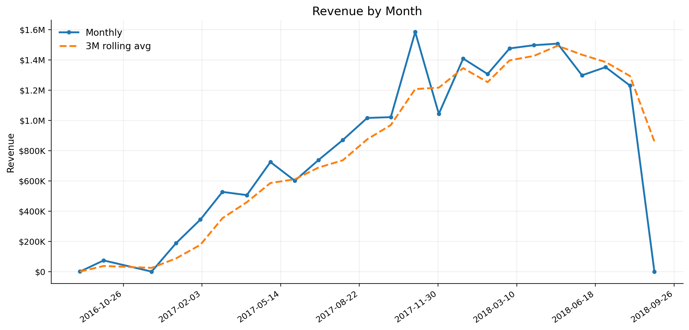
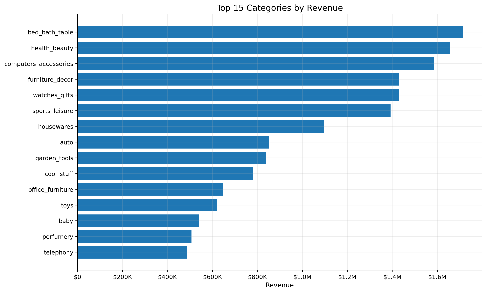
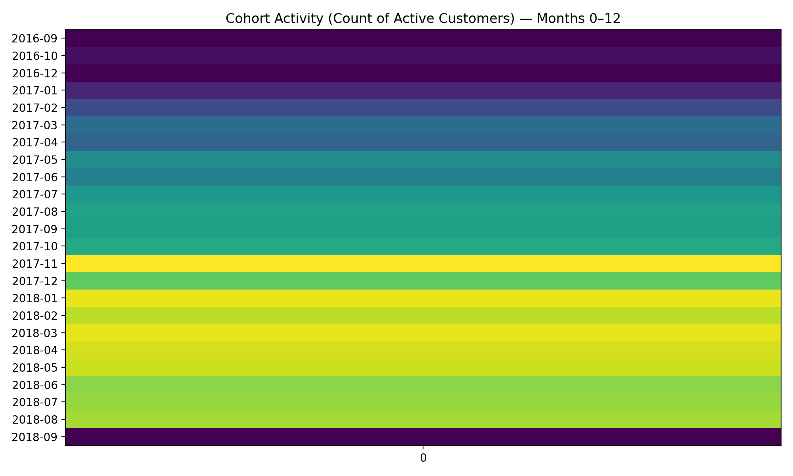

# pbi-semantic-model-sales-ops-olist

## Live HTML Dashboard
https://simasaadi.github.io/pbi-semantic-model-sales-ops-olist/dashboard/

Builds a DuckDB analytics model (staging → typed staging → star schema mart) on the Olist dataset, with SQL-based data tests, a small performance benchmark, and generated KPI charts.

## What’s inside
- DuckDB pipeline: loads raw CSVs into staging tables, types them, then builds a mart star schema
- Data tests: PK/FK integrity + value/range sanity checks
- Performance: benchmark query before/after indexes using EXPLAIN ANALYZE
- Charts: KPI visuals generated from the mart tables (docs/charts)

## Project structure
data/
  raw/                      # raw Olist CSVs (CI pulls from GitHub Release)
  processed/olist.duckdb     # generated DuckDB database (local output)

sql/
  01_staging/
  02_staging_typed/
  03_model/
  99_perf/

tests/
pipelines/
.github/workflows/
docs/charts/                # generated charts (PNG)
scripts/                    # helper scripts (chart generation)
requirements.txt

## Visualizations (generated from DuckDB marts)

### Revenue trend

### Top categories

### Cohort activity

## How to run locally (Windows PowerShell)

1) Build DB + model

.\tools\duckdb\duckdb_cli-windows-amd64\duckdb.exe data\processed\olist.duckdb -f sql\01_staging\load_staging.sql
.\tools\duckdb\duckdb_cli-windows-amd64\duckdb.exe data\processed\olist.duckdb -f sql\02_staging_typed\stg_typed.sql
.\tools\duckdb\duckdb_cli-windows-amd64\duckdb.exe data\processed\olist.duckdb -f sql\03_model\build_star.sql

2) Run tests (report)

.\tools\duckdb\duckdb_cli-windows-amd64\duckdb.exe data\processed\olist.duckdb -f tests\duckdb_test_report.sql

## Generate charts locally (Windows PowerShell)

python -m venv .venv
.\.venv\Scripts\activate
pip install -r requirements.txt
python scripts\make_charts.py

## CI
GitHub Actions runs the same pipeline on Ubuntu:
- Downloads DuckDB CLI
- Downloads the raw dataset zip from a GitHub Release
- Unzips into data/raw
- Runs staging → typed → mart → tests
- Uploads build artifacts

## Performance benchmark
Benchmark query: year-month rollup for 2018.

Before indexes: 0.0085s  
After indexes: 0.0057s  
Improvement: ~33% faster

Indexes added:
- mart.fact_order_item(purchase_date_key)
- mart.fact_order_item(customer_id)
- mart.fact_order_item(product_id)
- mart.fact_order_item(seller_id)
- mart.dim_date(date_key)

## Notes
- Raw dataset is kept out of Git history and supplied to CI via GitHub Releases.
- The generated olist.duckdb is local output and should not be committed.
